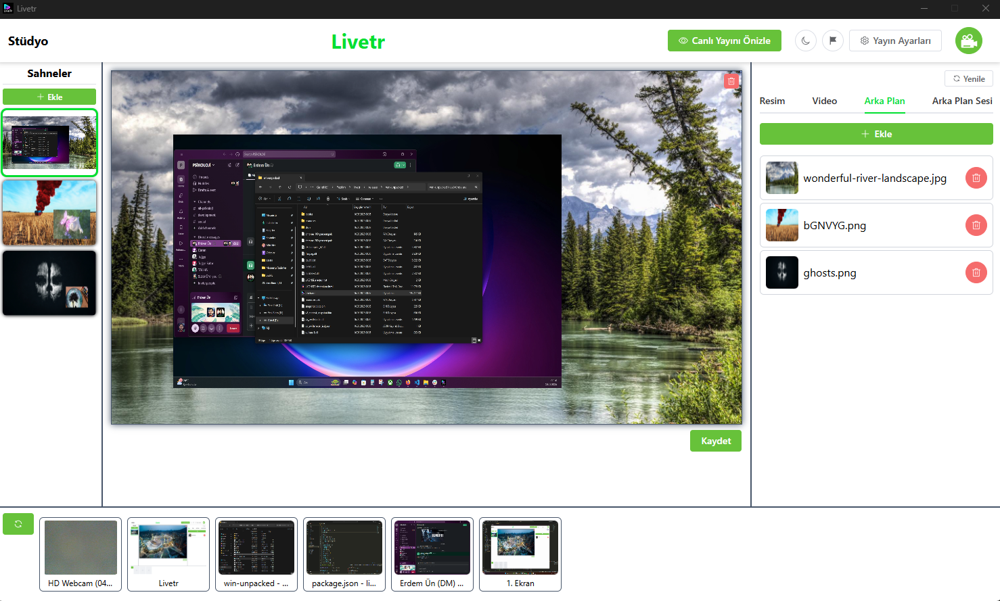
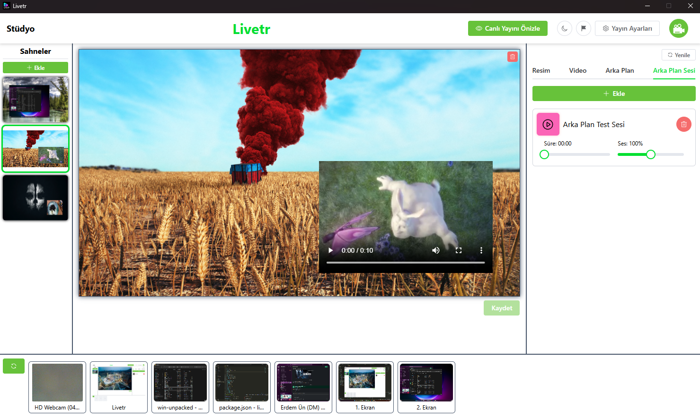
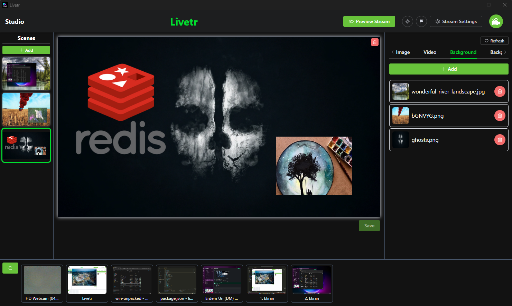
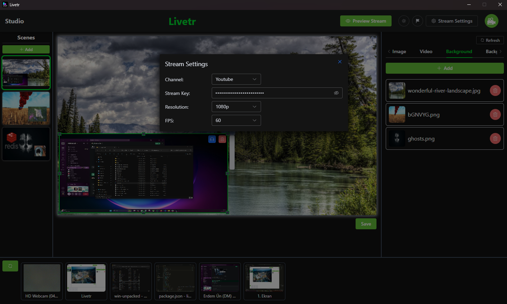

# LiveTr

## Installation

- npm i

## Development

Open 2 terminal

- npm run dev

wait for development host to run

- npm run electron

## Setup

- npm run build

change `"type": "module"` to `"type": "commonjs"` in **package.json**

- npm run setup

## Images

  
  

  
  

