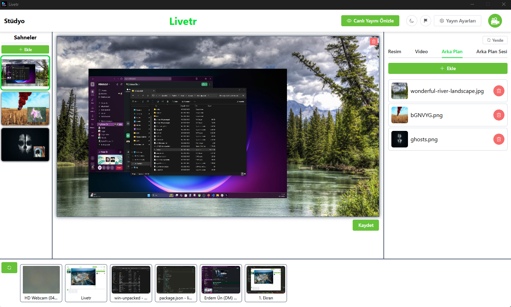
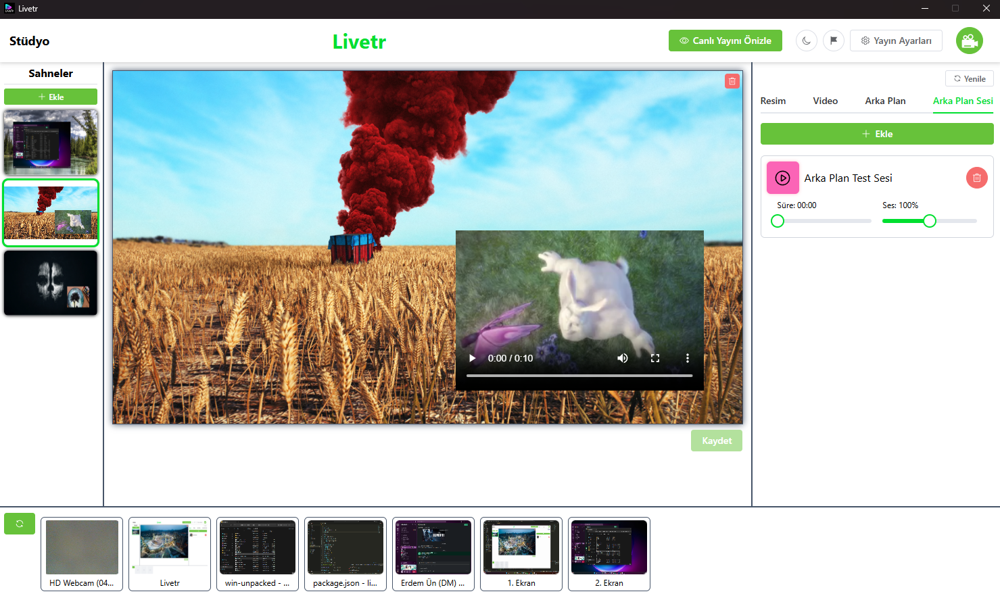
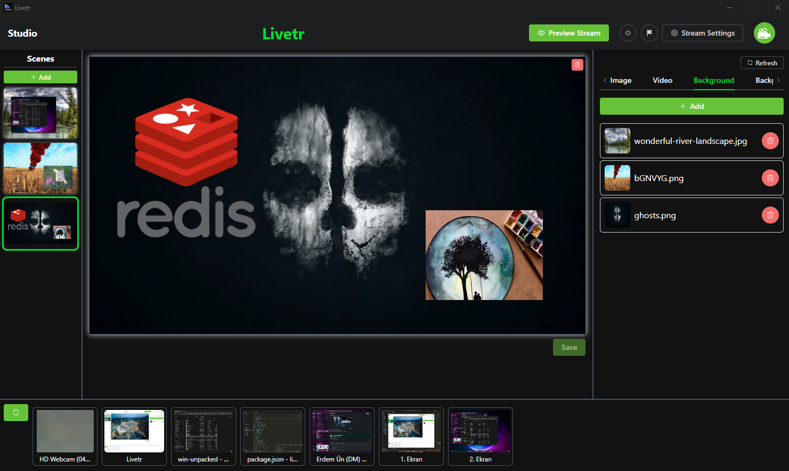
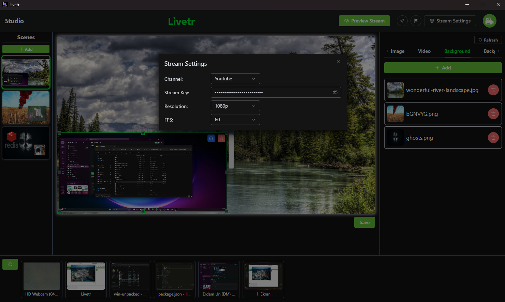

<p align="center" width="100%">
  
</p>

Livetr is a desktop live streaming studio. Build scenes from cameras, screen/window captures, videos, images, text and background music, then stream them to **YouTube**, **Twitch** or any **custom RTMP/RTMPS** server.

## Installation

**Node.js ≥ v20.11.0** must be installed on your computer.

```sh
npm install
```

## Development

### Desktop (Electron)

Open 2 terminals:

```sh
npm run dev
```

```sh
npm run electron
```

`npm run electron` waits for the development server (`http://localhost:3001`), so the commands can be started in any order.

### Web

```sh
npm run dev
```

and open `http://localhost:3001` in a browser. The editor also works in the browser, but desktop features (live streaming with ffmpeg, window/screen list, saving files to disk) are disabled there. In the browser, data is kept in `localStorage` and selected media files are only available until the page is reloaded.

## Run the production build locally

```sh
npm start
```

## Setup

```sh
npm run setup
```

The installer is created in the `release` folder (Windows: NSIS, macOS: dmg, Linux: AppImage). `ffmpeg-static` downloads the ffmpeg binary of the platform where `npm install` runs, so build the installer on the target platform.

## Live Stream

```
scene canvas + audio mixer → MediaRecorder (WebM, VP8/Opus) → IPC → ffmpeg (Electron main process) → RTMP
```

- The scene is drawn to a canvas at the selected output resolution and FPS. The renderer has no Node.js access; ffmpeg runs in the Electron main process.
- ffmpeg output follows the recommended settings of Twitch and YouTube: H.264 (x264 `veryfast`), constant frame rate, 2 second keyframe interval, CBR-like video bitrate (1080p: 6000, 720p: 4500, 480p: 2500, 360p: 1000, 160p: 300 kbps), AAC 128 kbps, 48 kHz stereo, FLV.
- The navbar shows the stream time, bitrate and FPS while live. A warning is shown when the connection or the computer can't keep up.
- Stopping the stream flushes the last frames and closes the RTMP connection cleanly. Closing the app while live asks for confirmation.
- The stream keeps running while the window is minimized or in the background.
- **Local Recording** (Stream Settings) also saves the stream to `Videos/Livetr` as an MPEG-TS (`.ts`) file.

## Data

| Environment   | Location                                                                                                                |
| ------------- | ----------------------------------------------------------------------------------------------------------------------- |
| Development   | `store` folder of the project                                                                                           |
| Installed app | Windows: `%APPDATA%\livetr\store`, macOS: `~/Library/Application Support/livetr/store`, Linux: `~/.config/livetr/store` |

Data of older versions (the `store` folder next to the application) is copied to the new location on the first start. Writes are atomic; if a data file is corrupted, a backup is kept and the defaults are loaded.

Environment variables:

- `LIVETR_DATA_DIR`: use another data folder
- `LIVETR_FFMPEG_PATH`: use another ffmpeg binary
- `LIVETR_DEV_SERVER_URL`: development server address (default `http://localhost:3001`)

## Test

[Youtube Test Stream](https://www.youtube.com/live/6Y_qa8jRc9Y)

## Images

|  |  |
| ------------------------------ | ------------------------------ |
|  |  |
